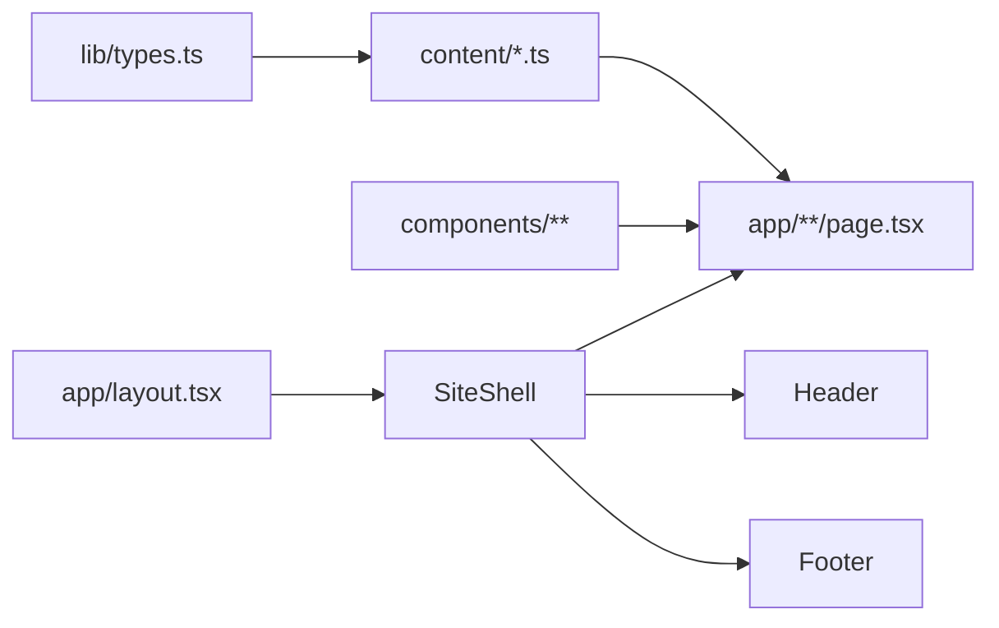

# Architecture

## Stack

```
Next.js 16 (App Router)
├── TypeScript (strict)
├── Tailwind CSS v4 (@theme inline tokens)
├── next/font (Fraunces + Work Sans)
└── Static generation (Vercel-ready)
```

## Directory structure

```
app/                          # Routes (App Router)
├── layout.tsx                # Root layout: fonts, metadata, SiteShell
├── page.tsx                  # Home
├── research/page.tsx         # Research Program
├── projects/
│   ├── page.tsx              # Projects index
│   └── [slug]/page.tsx       # Project detail
├── digital-scholarship/page.tsx
├── publications/page.tsx
├── teaching/page.tsx
├── public-humanities/page.tsx
├── about/page.tsx
└── contact/page.tsx

components/
├── layout/                   # Header, Footer, SiteShell
├── editorial/                # Kicker, Rule, PageHeader, Section
├── content/                  # (Phase 2+) ProjectCard, PublicationEntry, etc.
└── ui/                       # (Phase 4) shadcn primitives if needed

content/                      # Typed data (no CMS)
lib/                          # types.ts, utils.ts

public/
├── cv/                       # CV PDF
└── images/
    ├── portrait/
    ├── projects/
    └── books/
```

## Data flow



## Routing

| Path | Static | Notes |
|------|--------|-------|
| `/` | Yes | Homepage |
| `/research` | Yes | Research Program |
| `/projects` | Yes | Grouped index |
| `/projects/[slug]` | Yes | `generateStaticParams` from `content/projects.ts` |
| `/digital-scholarship` | Yes | Full page label in nav |
| `/publications` | Yes | Featured + full list (Phase 2) |
| `/teaching` | Yes | |
| `/public-humanities` | Yes | |
| `/about` | Yes | |
| `/contact` | Yes | mailto only, no backend |

## i18n readiness

Content interfaces use string fields structured for future locale keys:

```typescript
// Future: { en: string; es?: string }
// Phase 1: plain strings with English placeholders
```

## What is explicitly out of scope

- API routes (except optional static assets)
- Server actions with persistence
- Authentication
- Database or ORM
- CMS webhooks
- Client-side publication management
